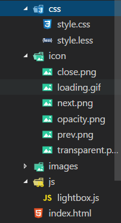

# lightbox

### 用法

1.在HTML文件中引入[jquery](https://code.jquery.com/jquery-3.2.1.min.js)、[lightbox.js](public/js/lightbox.js)、[style.css](public/css/style.css)和icons

    <link rel="stylesheet" type="text/css" href="./css/style.css">
    
    

文档按如下分布

2.给要添加图片预览的图片加上以下属性：

    class="js-lightbox"//调用lightbox的图片
    data-source="./images/1-3.jpg"//图片源
    data-group="group-1"//图片组别
    data-id="3"//图片ID，唯一标识
    data-caption= "1"//图片标题

3.引入lightbox类

    

---

### 示例

    <h1>1组图片</h1>
    

        
        
        
    

